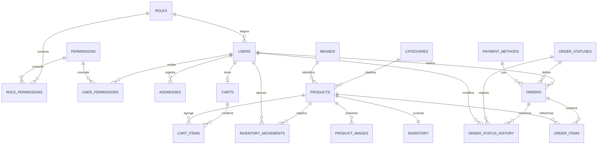

# SS Nova Technology
## Fase 2: Diseno de la base de datos

**Version:** 1.0  
**Fecha:** 2026-08-21  
**Estado:** Completada

## 1. Objetivo

Traducir los requisitos de la Fase 1 a un modelo relacional para MySQL 8, preservando la integridad de usuarios, catalogo, inventario, carritos y pedidos.

## 2. Modelo entidad-relacion



## 3. Tablas y responsabilidades

| Tabla | Responsabilidad |
|---|---|
| `roles` | Roles del sistema, inicialmente cliente y administrador. |
| `permissions` | Permisos extensibles para autorizacion. |
| `role_permissions` | Relacion entre roles y permisos. |
| `users` | Cuentas, credenciales y estado de los usuarios. |
| `user_permissions` | Excepciones de permisos asignadas directamente a un usuario. |
| `categories` | Clasificacion del catalogo. |
| `brands` | Marcas de los productos. |
| `products` | Informacion comercial y publica del producto. |
| `product_images` | Rutas y orden de las imagenes. |
| `inventory` | Existencia actual y umbral de inventario bajo. |
| `inventory_movements` | Trazabilidad de entradas y salidas. |
| `addresses` | Direcciones guardadas por cada cliente. |
| `carts` | Un carrito persistente por cliente. |
| `cart_items` | Productos y cantidades del carrito. |
| `payment_methods` | Metodos de pago habilitados. |
| `order_statuses` | Catalogo de estados logisticos. |
| `orders` | Cabecera del pedido y datos historicos de entrega. |
| `order_items` | Productos comprados con nombre, SKU y precio historicos. |
| `order_status_history` | Historial de cambios de estado del pedido. |

## 4. Criterios de diseno

- Todas las tablas utilizan InnoDB y claves foraneas.
- Los importes usan `DECIMAL(12, 2)`; no se utilizan tipos de coma flotante para dinero.
- Los pedidos conservan una copia de los datos de entrega y del precio del producto para mantener su historial aunque cambie el catalogo.
- Los productos, usuarios, categorias y marcas se pueden desactivar mediante `is_active` cuando una eliminacion fisica romperia referencias historicas.
- Las operaciones de confirmacion de pedidos deben usar una transaccion y bloquear las filas de `inventory` mientras se valida y descuenta la existencia.
- Las contrasenas se almacenan unicamente como hashes generados por PHP.
- Los indices cubren correo, catalogo, filtros, pedidos por cliente y pedidos por estado.

## 5. Integridad y reglas implementadas

- Correos, SKU, slugs, nombres de rol, permisos, estados y metodos de pago son unicos donde corresponde.
- Los precios y totales no pueden ser negativos.
- Las cantidades del carrito y de los pedidos deben ser mayores que cero.
- Las imagenes se eliminan al eliminar su producto.
- Una marca eliminada deja sus productos sin marca mediante `ON DELETE SET NULL`.
- Los usuarios y productos relacionados con pedidos se conservan para no romper el historial.
- El detalle del pedido admite que el producto original ya no exista, pero conserva nombre, SKU y precio.

## 6. Script de instalacion

El script completo esta en [database/schema.sql](../database/schema.sql).

Desde la consola de XAMPP, o con el cliente MySQL configurado, ejecuta:

```bash
mysql -u root -p < database/schema.sql
```

Si la instalacion local de XAMPP no tiene contrasena para `root`, omite `-p`:

```bash
mysql -u root < database/schema.sql
```

El script crea la base de datos `ss_nova_technology`, sus tablas, catalogos iniciales, categorias, una marca generica y el usuario administrador inicial.

## 7. Usuario administrador inicial

- **Correo:** `admin@ssnovatechnology.local`
- **Contrasena temporal definida para desarrollo:** `Admin123!`

Antes de usar el script en un entorno compartido o de produccion, cambia la contrasena inmediatamente despues del primer acceso. Nunca se debe guardar una contrasena plana en la base de datos.

## 8. Transaccion requerida para crear un pedido

La implementacion MVC de la fase posterior debe seguir este orden conceptual:

1. Iniciar transaccion.
2. Leer los items del carrito y sus productos.
3. Bloquear cada fila correspondiente de `inventory` con `SELECT ... FOR UPDATE`.
4. Verificar que cada existencia sea suficiente.
5. Crear `orders` y `order_items` usando los precios consultados en el servidor.
6. Descontar `inventory` y registrar `inventory_movements`.
7. Crear el primer registro de `order_status_history`.
8. Vaciar el carrito.
9. Confirmar la transaccion; hacer rollback ante cualquier error.

## 9. Criterios de aceptacion de la Fase 2

- [x] El modelo entidad-relacion esta documentado.
- [x] Las tablas, claves y relaciones estan definidas.
- [x] Se incluyeron indices y restricciones de integridad.
- [x] Se incluyeron roles, permisos, estados y metodos de pago iniciales.
- [x] El script SQL esta separado en `database/schema.sql`.
- [x] Ejecutar el script en la instancia local de XAMPP (MariaDB 10.4 compatible).
- [ ] Validar consultas CRUD basicas en la Fase 3.

## 10. Nota de instalacion

El orden de creacion y eliminacion del script respeta las dependencias de claves foraneas, por lo que puede ejecutarse desde cero en MySQL 8.
