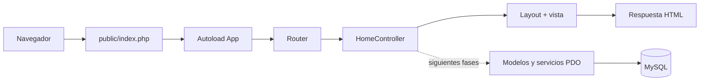

# SS Nova Technology
## Fase 3: Estructura MVC del proyecto

**Version:** 1.0  
**Fecha:** 2026-08-21  
**Estado:** Completada

## 1. Objetivo

Crear una base MVC ejecutable para que las siguientes fases agreguen autenticacion, catalogo y CRUD sin mezclar rutas, logica de negocio, acceso a datos y HTML.

## 2. Estructura creada

```text
/.env.example
/config/config.php
/core/Controller.php
/core/Database.php
/core/Router.php
/controllers/HomeController.php
/database/schema.sql
/docs/FASE-1-ANALISIS-Y-ALCANCE.md
/docs/FASE-2-DISENO-BASE-DE-DATOS.md
/docs/FASE-3-ESTRUCTURA-MVC.md
/public/index.php
/public/.htaccess
/public/assets/css/app.css
/views/home/index.php
/views/layouts/main.php
```

## 3. Responsabilidad de cada componente

- `public/index.php`: Front Controller y punto de entrada publico.
- `config/config.php`: carga configuracion desde `.env` y aplica valores locales por defecto.
- `core/Router.php`: registra y despacha rutas HTTP.
- `core/Controller.php`: ofrece el renderizado comun de vistas.
- `core/Database.php`: crea una conexion PDO singleton con consultas preparadas desactivando emulacion.
- `controllers/HomeController.php`: controlador inicial de la pagina principal.
- `views/layouts/main.php`: HTML compartido, navegacion y pie de pagina.
- `views/home/index.php`: contenido de la pagina inicial.
- `public/assets/css/app.css`: estilos base responsive.
- `public/.htaccess`: redirige rutas que no son archivos o carpetas hacia el Front Controller.
- `.env.example`: variables de configuracion que deben copiarse a `.env`.

## 4. Configuracion local

1. Copia `.env.example` con el nombre `.env` en la raiz del proyecto.
2. Verifica `DB_NAME`, `DB_USER` y `DB_PASS` segun tu instalacion de XAMPP.
3. Mantén `.env` fuera del control de versiones.
4. En Apache, abre `http://localhost/SS_NOVA_TECHNOLOGY/public/`.

La configuracion por defecto espera:

- Host: `127.0.0.1`
- Puerto: `3306`
- Base de datos: `ss_nova_technology`
- Usuario: `root`
- Contrasena: vacia

## 5. Flujo de una solicitud



## 6. Seguridad inicial

- La carpeta publica contiene solamente el punto de entrada y los recursos web.
- Las credenciales se leen desde `.env`, no desde una vista.
- PDO usa `PDO::ATTR_EMULATE_PREPARES = false`.
- Las variables mostradas en HTML se escapan con `htmlspecialchars`.
- Los errores detallados solo se muestran cuando `APP_DEBUG=true`.
- Las rutas desconocidas responden con HTTP 404.

La autenticacion, CSRF, autorizacion y regeneracion de sesion se implementaran en la Fase 4 antes de crear formularios sensibles.

## 7. Validaciones realizadas

- Sintaxis PHP validada con el ejecutable de XAMPP.
- La ruta `/SS_NOVA_TECHNOLOGY/public/` renderiza la pagina inicial.
- La base de datos local ya contiene el esquema de la Fase 2.
- `Database::connection()` queda preparado para la primera consulta de la Fase 4.

## 8. Criterios de aceptacion

- [x] Existe un Front Controller.
- [x] Existe un router centralizado.
- [x] Existe un controlador y una vista inicial.
- [x] Existe un layout reutilizable.
- [x] Existe una clase PDO centralizada.
- [x] La configuracion sensible esta separada mediante `.env`.
- [x] La ruta inicial funciona dentro de la carpeta de XAMPP.
- [x] La sintaxis de todos los archivos PHP fue validada.

## 9. Siguiente fase

La Fase 4 implementara registro, inicio de sesion, cierre de sesion, contrasenas cifradas, sesiones seguras, validacion de formularios, proteccion CSRF y middleware de autenticacion.
